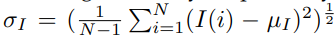
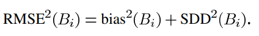

# Deep Learning for Image Super-resolution: A Survey
## I: Dataset for Super-resolution
|STT|Dataset|Amount|Avg.Resolution|Format|Category Keywords|
|-|-|-|-|-|-|-|-|-|-|
|1|[BSDS300](https://www2.eecs.berkeley.edu/Research/Projects/CS/vision/bsds/)|300|(435, 367) |JPG|animal, building, food, landscape, people, plant, etc.
|2|[BSDS500](https://www2.eecs.berkeley.edu/Research/Projects/CS/vision/grouping/resources.html#bsds500)|500|(432, 370) |JPG|animal, building, food, landscape, people, plant, etc.
|3|[DIV2K](https://data.vision.ee.ethz.ch/cvl/DIV2K/)|1000|(1972, 1437) |PNG|environment, flora, fauna, handmade object, people, scenery, etc.
|4|[General-100](https://drive.google.com/file/d/0B7tU5Pj1dfCMVVdJelZqV0prWnM/view)|100|(435, 381)|BMP|animal, daily necessity, food, people, plant, texture, etc.
|5|[Manga109](http://www.manga109.org/en/download.html)|109|(826, 1169)|PNG|manga volume|
|6|[OutdoorScene]()|10624|(553, 440) |PNG|animal, building, grass, mountain, plant, sky, water.
|7|[PIRM](https://pirm.github.io/)|200|(617, 482)|PNG|environments, flora, natural scenery, objects, people, etc.
|8|[Set5](https://www.kaggle.com/ll01dm/set-5-14-super-resolution-dataset/data)|5|(313, 336)|PNG|baby, bird, butterfly, head, woman
|9|[Set14](https://www.kaggle.com/ll01dm/set-5-14-super-resolution-dataset/data)|14|(492, 446)|PNG|humans, animals, insects, flowers, vegetables, comic, slides, etc.
|10|[T91](https://www.kaggle.com/ll01dm/t91-image-dataset)|91|(264, 204) |PNG|car, flower, fruit, human face, etc.
|11|[Urban100](https://github.com/jbhuang0604/SelfExSR)|100|(984, 797)|PNG|architecture, city, structure, urban, etc.
## II: Image Quality Assessment
1. [Peak Signal-to-Noise Ratio (PSNR)](https://www.researchgate.net/publication/3327793_Image_Quality_Assessment_From_Error_Visibility_to_Structural_Similarity) (**code**)
   - PSNR is defined via the maximum pixel value (denoted as L) and the mean squared error (MSE) between images. 
2. [Structural Similarity](https://www.researchgate.net/publication/3327793_Image_Quality_Assessment_From_Error_Visibility_to_Structural_Similarity)(**code**)
   - The structural similarity index (SSIM) is proposed for measuring the structural similarity between images, based on independent comparisons in terms of luminance, contrast, and structures.
     - For an image I with N pixels, the luminance µI and contrast σI are estimated as the mean and standard deviation of the image intensity, respectively.
     -   
   - where I(i) represents the intensity of the i-th pixel of image I. And the comparisons on luminance and contrast, denoted as Cl(I, ˆI) and Cc(I, ˆI) respectively, are given by:
     - 
     - where C1 = (k1L)^2, C2 = (k2L)^2 are constants for avoiding instability, k1 << 1 and k2 << 1
   - Structure comparison function Cs(I, ˆI) is defined as:
     - 
     - where σI,Iˆ is the covariance between I and ˆI, and C3 is a constant for stability
   - Finally, the SSIM is given by:
     - 
     - where α, β, γ are control parameters for adjusting the relative importance.
3. [The multi-scale structural similarity (MS-SSIM)](https://www.cns.nyu.edu/pub/eero/wang03b.pdf)(**code**)
   - At the j-th scale, the contrast comparison (2) and the structure comparison (3) are calculated and denoted as cj (x, y) and sj (x, y), respectively. The luminance comparison (1) is computed only at Scale M and is denoted as lM(x, y). 
   - 
4. Mean Opinion Score (MOS)(**code**)
   - Mean opinion score (MOS) testing is a commonly used subjective IQA method, where human raters are asked to assign perceptual quality scores to tested images. Typically, the scores are from 1 (bad) to 5 (good). And the final MOS is calculated as the arithmetic mean over all ratings.
5. Mean Squared Error (MSE)(**code**)
   - 
6. Root Mean Sqaured Error (RMSE) (**code**)
   - 
7. Natural Image Quality Evaluator (NIQE)
8.  The Feature Similarity (FSIM)
9.  Information Fidelity Criterion (IFC)
10. Noise Quality Measure (NQM)
11. [Universal Quality Image Index (UQI)](https://ece.uwaterloo.ca/~z70wang/publications/quality_2c.pdf)(**code**)
    - Let x = {xi | i = 1,2, ... N} and y = {yi | i = 1,2, .. N} be the original and the test image signals, respectively. The proposed quality index is defined as.
    - 
    - The dynamic range of Q is [-1, 1]. The best value 1 is achieved if and only if yi = xi.
12. [Relative Average Spectral Error (RASE)](http://citeseerx.ist.psu.edu/viewdoc/download?doi=10.1.1.597.7002&rep=rep1&type=pdf)(**code**)
    - In order to estimate the global spectral quality of the merged images, we have used the following parameters.The relative average spectral error (RASE) index expressed as a percentage. It characterizes the average performance of the method in the spectral bands considered
    - 
    - Where M is the mean radiance of the N spectrl bands (Bi) of the original MS image, and the RMSE is the root mean square error computed in following the expression:
    - 
    - Standard deviation of the difference image (SDD), relative to the mean of the original image, expressed as percentage. The lower the value of this parameter, the better the spectral quality of the merged image.
    - Difference between the means of the original and the merged images (bias), in radiance as well as its value relative to the mean of the original image(RM) The smaller these differences are, the better the spectral quality of the merged image. They should be as close to 0 as possible
13. [Erreur Relative Globale Adimensionnelle de Synthèse (ERGAS)](https://hal.archives-ouvertes.fr/hal-00395027/document)(**code**)
    - The erreur relative globale adimensionnelle de synthèse (ERGAS) index (or relative global dimensional synthesis error) in the fusion
    - 
    - Where h is the resolution of the high spatial resolution image and l the resolution of the low spatial resolution image and Mi the mean radiance of each spectral band involved in the fusion.
14. [Spatial Correlation Coefficient (SCC)](https://www.tandfonline.com/doi/abs/10.1080/014311698215973)(**code**)
15. [Block Sensitive - Peak Signal-to-Noise Ratio (PSNR-B)](http://www.gpds.ene.unb.br/databases/2012-UNB-Varium-Exp/Exp3-Delft/00-report-alexandre/Papers---Searched/QualityAssessmentDeblockedImages.pdf)(**code**)
    - Propose a new block-sensitive image quality metric which we term peak signal-to-noise ratio including blocking effects (PSNR-B).As the quantization step size increases, blocking artifacts generally become more conspicuous. Blocking artifacts are gray level discontinuities at block boundaries, which are ordinarily oriented horizontally and vertically. They arise from poor representation of the block luminance levels near the block boundaries. Block-base 8x8 blocks.
    - We, therefore, consider blocking artifacts that occur along the horizontal and vertical orientations. Let Nh and Nv be the horizontal and vertical dimensions of the Nh x Nv image I.
    - 
    - Let H be the set of horizontal neighboring pixel pairs in I. Let Hb ⊂ H be the set of horizontal neighboring pixel pairs that lie across a block boundary. Let Hcb be the set of horizontal neighboring pixel pairs, not lying across a block boundary, i.e., Hcb = H - Hb.Similarly, let V be the set of vertical neighboring pixel pairs, and Vb be the set of vertical neighboring pixel pairs lying across block boundaries. Let Vcb be the set of vertical neighboring pixel pairs not lying across block boundaries, i.e., . Vcb = V - Vb.
    - 
    - If B is the block size, then
    - 
    - The sets of pixel pairs in this example are.
    - 
    - Then define the mean boundary pixel squared difference (Db) and the mean nonboundary pixel squared difference (Dcb) for image y to be
    - 
    - Generally, as the quantization step size increases, Db will increase relative to Dcb, and blocking artifacts will become more visible. Also define the blocking effect factor
    - 
    - Where  emphasizes the BEF as a function of block size. The assumption here is that the visibility of blocking effects increases with block size.
    - Let Dbk, Dcbk, BEFk and ηk modify for block size Bk. Then
    - 
    - The BEF over all block sizes is defined as 
    - 
    - The mean-squared error including blocking effects (MSE-B) for reference image x and test image y is then defined as the sum of the MSE(x, y) and BEFtot. The MSE term measures the distortion between the reference image x and the test image y, while the BEF term specifically measures the amount of blocking artifacts just using the test image y.
    - 
    - Finally, we propose the PSNR-B as
    - 
    - The associated quality index PSNR-B is obtained from the MSE-B by a logarithmic function, as is the PSNR from the MSE. The PSNR-B is attractive since it is specific for assessing image quality, specifically the severity of blocking artifacts. 
16. [Visual Information Fidelity (VIF)](https://live.ece.utexas.edu/publications/2004/hrs_ieeetip_2004_imginfo.pdf)(**code**)
    - 
    - The visual information fidelity (VIF) measure that we propose in this paper is derived from a quantification of two mutual information quantities: the mutual information between the input and the output of the HVS channel when no distortion channel is present (we call this the reference image information) and the mutual information between the input of the distortion channel and the output of the HVS channel for the test image. We discuss the components of the proposed method in this section.
    - A Gaussian Scale Mixtures (GSM) is a random field (RF) that can be expressed as a product of two independent RFs. That is, a GSM , where I denotes the set of spatial indices for the RF, can be expressed as :  where S is an RF of positive scalars and U is a Gaussian vector RF with mean zero and covariance Cu. Vector C and U are M dimensional vectors, and we assume that for the RF U, vector U is independent the steerable pyramid of an image as a GSM RF. We partition the subband coefficients into non-overlapping blocks of M coefficients each, and model block i as the vector Ci.
    - The purpose of a distortion model i to describe how the statistics of an image are disturbed by a generic distortion operator. The distortion model that we have chosen provides important functionality while being mathematically tractable and computationally simple. It is a signal attenuation and additive noise model in the wavelet domain:
    -  where C denotes the RF from a subband in the reference signal, D denotes the RF from the corresponding subband from the test (distorted) signal, G is a deterministic scalar gain field, and V is a stationary additive zero-mean Gaussian noise RF with variance . The RF v is white, and is indeoendent of S and U. We constrain the field G to be slowly-varying.
    - The Human Visual System (HVS) model that we use is also described in the wavelet domain. Since HVS models are the dual of natural scene statistics (NSS) models many aspects of the HVS are already modeled in the NSS description, such as a scale-spaceorientation channel decomposition, response exponent, and masking effect modeling.
    - The purpose of HVS model in the information fidelity setup is to quantify the uncertainty that the HVS adds to the signal that flows through it. We call this lumped HVS distortion visual noise, and model it as a stationary, zero mean, additive white Gaussian noise model in the wavelet domain. Thus, we model the HVS noise in the wavelet domain as stationary RFs  where vector Ni and vecotr N'i are zero-mean uncorrelated multivariate Gaussian with the same dimensionality as vector Ci:
    -  where E and F denote the visual signal at the output of the HVS model from the reference and the test images in one subband respectively, from which the brain extracts cognitive information. The RFs N and N' are assumed to be independent of U,S and V. We model the covariance of N and N' as:
    -  where  is an HVS model parameter (variance of the visual noise)
    - With the souce, distortion and HVS models as decribed above, the visual information idelity criterion that we propose can be derived. Let  be conrrespondingly defined.
    - The mutual information  quantifies the amount of information that can be extracted from the output of the HVS by the brain when the test image is being viewed. the natural scene model to a specific reference image by treating , where s^N denotes a realization of S^N for particular reference image. The realization s N could be thought of as ‘model parameters’ for the associated reference image. The conditioning on S is intuitively in line with divisive normalization models for the visual neurons [1], and lends the VIF to analytical tractability as well.
    - . With the stated assumptions on C and the distortion model, get:
    - 
    - Similarly we can show that for the test image
    - 
    - Since Cu is symmetric, it can be factored as Cu = QAQ^T, where Q is an orthonormal matrix, and  A is a diagonal matrix of eigenvalues λk. One can use this matrix factorization to show: 
    - 
    -  and  represent the information that could ideally be extracted by the brain from a particular subband in the reference and the test images respectively. We call  the reference image information.
    - We discovered that a simple ratio of the two information measures relates very well with visual quality. It is easy to motivate this choice of relationship between image information and visual quality. When a human observer sees a distorted image, he has an idea of the amount of information that he expects to receive in the image (modeled through the known S field), and it is natural to expect the proportion of the expected information actually received from the distorted image to relate well with visual quality. Also we have only dealt with one subband so far. One could easily incorporate multiple subbands by assuming that each subband is completely independent of others in terms of the RFs as well as the distortion model parameters. Thus, the VIF that we propose in this paper is given by:
    -  where we sum over the subbands of interest, and vector Cnj represent N elements of the RF Cj that describes the coefficients from subband j, and so on.
17.  [Spectral Distortion Index (D_lambda)](https://pdfs.semanticscholar.org/b6db/12e3785326577cb95fd743fecbf5bc66c7c9.pdf?_ga=2.135038649.992983529.1584061806-692294511.1584061806)(**code**)
     - Spectral Distortion Index can be derived from the difference of inter-band QI values calculated from the fused MS bands, indicated as , and from the low-resolution MS bands, . The terms  can be grouped into two LxL matrices. The two matrices are symmetrical and the values on the main diagonal are all equal to one.
     - A spectral distortion index referred to as Dλ, is calculated as:
     -  with p being a positive integer exponent chosen to emphasize large spectral differences: for p = 1, all differences are equally weighted; as p increases, large components are given more relevance. The index (Equation 5) is proportional to the p-norm of the difference matrix, being equal to 0, if and only if the two matrices are identical. If negative values of , originated by anti-correlated bands, are clipped below zero; then, Equation 5 is always lower than or equal to one.
18.  [Spatial Distortion Index (D_S)](https://pdfs.semanticscholar.org/b6db/12e3785326577cb95fd743fecbf5bc66c7c9.pdf?_ga=2.135038649.992983529.1584061806-692294511.1584061806)(**code**) 
     - Spatial Distortion Index is calculated as:
     -  in which P is the PAN image, and P~ a spatially degraded version of the PAN image obtained by filtering with a lowpass filter having normalized frequency cutoff at the resolution ratio between MS and PAN, followed by decimation. Analogously, Ds is proportional to the q-norm of the difference vector, where q may be chosen so as to emphasize higher difference values. The index Ds attains its minimum (equal to zero), when the two vectors are identical. Analogously to Equation 5, also Equation 6 is upper bounded by one if clipping below zero of Q values is enabled.
19.  [Quality with No Reference (QNR)](https://pdfs.semanticscholar.org/b6db/12e3785326577cb95fd743fecbf5bc66c7c9.pdf?_ga=2.135038649.992983529.1584061806-692294511.1584061806)(**code**)
     
     - Quality with No Reference, which is the product of the one's complements of the spatial and spectral distortion indices, each raised to a real-valued exponent that attributes the relevance of spectral and spatial distortions to the overall quality.The two exponents jointly determine the non-linearity of response in the interval [0,1], same as a gamma correction, to achieve a better discrimination of the fusion results compared:
     - 
     - Thus, the highest value of QNR is one and is obtained when the spectral and spatial distortions are both zero. The main advantage of the proposed index is that, in spite of the lack of a reference data set, the global quality of a fusion product can be assessed at the full scale of PAN.
20.  [Spectral Angle Mapper (SAM)](https://aviris.jpl.nasa.gov/proceedings/workshops/92_docs/52.PDF)(**code**)
     - The result of the comparison is reported as the angular difference (radian) between the two spectra according to the equation:
     - 
     - Here nb is the numbers of bands in the image. Each pair of spectra is treated as a vecto in nb-space, allowing the similarity of the spectra to be determined without regard to their relative brightness values (displayed in brighter values) corresponding to a better match between reference and test spectra.