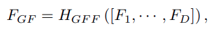

# Image Super-Resolution
` Content `
## Abtract
* Deep CNN base SR models do not make full use of the hierarchical features from the original low-resolution (LR) images, thereby achieving relatively-low performance. Propose a novel Residual Dense Network (RDN) to address this problem in image SR. Because it fully exploit the hierarchical features from all the convolutional layers. Propose Residual Dense Block (RDB) to extract abundant local features via dense connected convolution layers and allow direct connections from the state of preceding RDB to all the layers of current RDB. After fully obtaining dense local features, use global feature fusion to jointly and adaptively learn global hierarchical features in a holistic way.
## Introduction
* Propose a unified frame work residual dense net work (RDN) for high-quality image SR with different degradation models. The network makes full use of all the hierarchical features from the originall LR image.
* Propose residual dense block (RDB), which can not only read state from the preceding (RDB) via a contiguous memory (CM) mechanism, but also fully utilize all the layers  within it via local dense connections. The accumulated features are then adaptively preserved by local feature fusion (LFF).
* Propose global feature fusion to adaptively fuse hierarchical features from all RDBs in the LR space. With global residual learning, we combine the shallow features and deep features together, resulting in global dense features from the original LR image.
## Materials (Dataset)
* Image high-quality (2K resolution) Dataset [DIV2k](https://data.vision.ee.ethz.ch/cvl/DIV2K/) 800 training images, 100 validation images, 100 test images.
## Methods
* ### Residual Dense Network Structure mainly consists four part:
  * ### Shallow feature extraction net (SFENet) 
  *  the output Fd of the *d*-th RDB can be obtained by 
  *  after extracting hierarchical features with a set of RDBs further conduct dense feature fusion (DFF) which includes global feature fusion (GFF) and global residual learning (GRL). DFF makes full use of features from all the preceding layers and can be represented as 
  *  FDF is the output feature-maps of DFF by utilizing a composite function HDFF.
  * ### Redidual dense blocks (RDBs) contains dense connected layers, local feature fusion (LFF), and local residual learning, leading to a contiguous memory (CM) mechanism. 
    * CM mechanism is realized by passing the state of preceding RDB to each layer of current RDB. 
      * where σ denotes the ReLU, W is the weight *c*-th Conv layer. We assume Fd,c consists of G (also known as growth rate) feature-maps
    * Local feature fusion (LFF) 
      * 
      * Where HdLFF denotes the function of the 1 × 1 Conv layer in the d-th RDB. We also find that as the growth rate G becomes larger, very deep dense network without LFF would be hard to train.
    * Local residual learning (LRL) is introduced in RDB to further improve the information flow, as there are several convolutional layers in one  RDB. The final output of the d-th RDB can be obtained by
      * 
  * ### Dense feature fusion (DFF) consists of global feature fusion (GFF) and global residual learning (GRL).
    * GFF is propose to extract the global feature FGF by fusing features from all the RDBs 
    * 
    * GRL is then utilized to obtain the feature-maps before conducting up-scaling
    * 
  * ### Up-sampling net (UPNet)
## Experimental result
* Original----------------------------------------------------Noise-cancel(250x240)
*  ----------------------->  
* PSNR-large(250x240)------------------------------------PSNR-small(250x240
*  
* ----------------------------------------------GANs(500x480----------------------------------------------
* 
* Original (260x200) 
* Noise-cancel (520x400)  
* PSNR-large (520x400) 
* PSNR-small (520x400) 
* GANs (1040x800) 
## Discussion
## Conclusion